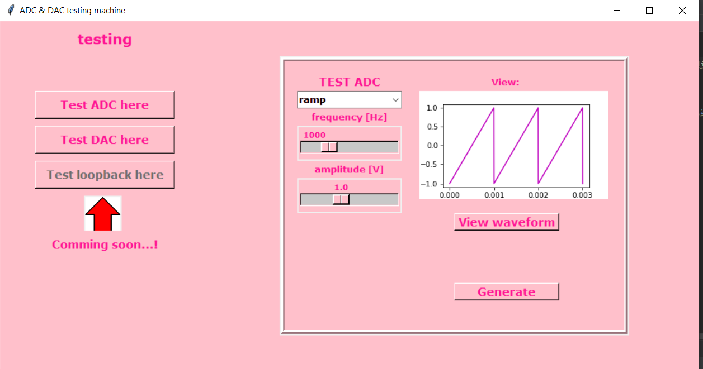

# AnalogDiscovery_ADC_DAC_testing
 This application is used to test ADC, DAC converters using Analog Discovery. It views theoretical and measured waveform. Only sinusoidal and ramp are implemented. 
 
 This picture presents how the app looks like:
 

When you clikc generate (it only works if you have Analog Discovery plugged to you computer) it will viewed a random score of your work and estimated calculated frequency of your DAC/ADC converter. Also it presents a waveform your ADC/DAC made. 

If you want to cheat just clik near Generate instead Generate button, you'll get always 6 grade :P

 
